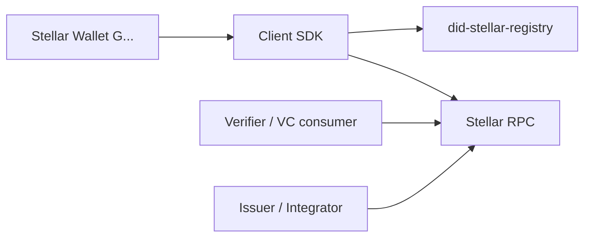

# `did:stellar` Method Specification v0.1

## Document Status

- **Status:** Draft v0.1 — public spec candidate
- **Method:** `did:stellar`
- **Canonical repository:** [ACTA-Team/contracts-acta](https://github.com/ACTA-Team/contracts-acta)
- **Networks:** `mainnet`, `testnet`
- **Last updated:** 2026-04-29
- **Conforms to:** [W3C DID Core 1.1](https://www.w3.org/TR/did-1.1/)

---

## Abstract

`did:stellar` is a Decentralized Identifier method for the Stellar network. An identity is materialized as an opaque 128-bit identifier registered in a canonical Soroban smart contract per network. The method is independent of any specific issuer, wallet-agnostic, and compliant with W3C DID Core 1.1.

---

## Terminology

| Term | Definition |
|---|---|
| **Controller account** | Classic Stellar account (`G...`) that authorizes on-chain mutations of a DID. |
| **DidRecord** | On-chain structure holding the current state of a DID. |
| **didId** | Opaque 128-bit identifier, base32 lowercase, exactly 26 characters. |
| **Registry contract** | Canonical Soroban contract maintaining the authoritative state of all DIDs on a given network. |
| **Tombstone document** | DID Document produced for a deactivated DID; contains empty cryptographic arrays. |

---

## 1. Goals and Design Decisions

### 1.1 Goals

- Provide an official DID method for Stellar, compliant with W3C DID Core 1.1.
- Survive wallet changes: the DID is not derived from any specific key.
- Resolve the DID Document from on-chain state using standard Stellar infrastructure.
- Support issuance and verification of Verifiable Credentials using `did:stellar` as `issuer` and `credentialSubject.id`.
- Keep the method core minimal and not coupled to specific integrators.

### 1.2 MVP Design Decisions

| Decision | Rationale |
|---|---|
| DID not derived from a wallet | A DID must survive key rotation; tying identity to a single key defeats the purpose. |
| Control via classic Stellar account `G...` | Uses existing Soroban authorization; no new key primitives needed. |
| Self-controlled DID (no `controller` field in DID Document) | Conforms to W3C DID Core 1.1 §5.1.2; prevents dependency on external DIDs. |
| On-chain state readable directly from Stellar RPC | No indexer required for latest state; deterministic and auditable. |
| Opaque 128-bit identifier | Decouples identity from any on-chain account; collisions are computationally negligible. |

### 1.3 Out of Scope (v0.1)

- Smart accounts (`C...`) as public controllers.
- Granular role-based delegation with per-key expiration.
- Social recovery mechanisms.
- Full historical version traversal.
- DID URLs with path or query components.
- Large on-chain documents.
- Indexing as an operational requirement.
- Backward compatibility with pre-existing Stellar DID schemes.
- Binding rules between `did:stellar` and operational accounts (integrator responsibility).

### 1.4 High-Level Architecture



**Actors:**

| Actor | Role |
|---|---|
| **Wallet** | Any classic Stellar account (`G...`) capable of signing Soroban transactions. Authorizes on-chain mutations. |
| **Client SDK** | Library that prepares Soroban transactions for the four mutation operations and assembles `DidRecord` payloads. |
| **Registry contract** | Canonical Soroban contract per network. Single source of truth for DID state. |
| **Verifier / Issuer / Integrator** | Any consumer of the DID. Reads current state directly from Stellar RPC. None has a privileged role within the method. |

No actor in this architecture is privileged beyond what is required to authorize their own mutations. The method is intentionally trust-minimized: the on-chain state is the authoritative source of truth, readable from Stellar RPC, and verification depends only on the DID Document constructed from that state.

---

## 2. DID Syntax

### 2.1 Canonical Form

```
did:stellar:{network}:{didId}
```

Where:
- `network` is `mainnet` or `testnet`.
- `didId` is an opaque 128-bit value encoded as base32 lowercase without padding (RFC 4648).

**Examples:**
```
did:stellar:mainnet:bk7q2x4m3r7n5s2v7t6y6p2cde
did:stellar:testnet:aaaqeayeaudaocajbifqydiob4
```

### 2.2 Validation Regex

```
^did:stellar:(mainnet|testnet):[a-z2-7]{26}$
```

Both `network` and `didId` components are always lowercase. The full DID MUST match this regex exactly. No additional parameters, paths, or queries are permitted in the canonical identifier.

### 2.3 DID Identifier Generation

1. The client generates 16 bytes using a cryptographically secure random number generator (CSPRNG).
2. Encode the 16 bytes as base32 lowercase without padding per RFC 4648, Section 6. The result MUST be exactly 26 characters.
3. Construct the DID: `did:stellar:{network}:{didId}`.
4. The 26-character `didId` is the base32 encoding; the 16 raw bytes are stored on-chain as `BytesN<16>` to minimize storage rent.
5. If the registry contract rejects registration due to a collision, the client retries with fresh random bytes.

### 2.4 Canonicalization Rules

- The full DID is always stored and exposed in lowercase.
- `network` does not accept aliases (`pubnet`, `public`, `horizon`, etc.).
- No DID parameters are accepted in the canonical identifier.
- Fragment references (`#...`) are used only to address keys or services within a resolved DID Document and are not part of the DID itself.

---

## 3. On-Chain Registry

### 3.1 Contract Overview

- **Logical name:** `did-stellar-registry`
- **Deployment:** One contract per network.
- **Source of truth:** Soroban persistent storage.
- **Primary read path:** Stellar RPC `getLedgerEntries`.
- **Mutation events:** `did_registered`, `did_updated`, `did_controller_transferred`, `did_deactivated`.

### 3.2 Data Model

The registry stores one `DidRecord` per DID. The `didId` is stored on-chain as 16 bytes (`BytesN<16>`) to reduce storage rent. The base32 ↔ bytes conversion is handled by the client SDK.

```rust
pub struct DidKey {
    pub public_key_multibase: String,  // Multikey encoding, e.g. z6Mk... for Ed25519
}

pub struct DidService {
    pub id_suffix: String,       // Lowercase alphanumeric + hyphen, max 32 chars
    pub service_type: String,    // Free string, max 64 chars
    pub service_endpoint: String // Absolute HTTPS URL, max 255 chars
}

pub struct DidRecord {
    pub controller: Address,              // Classic Stellar account G...
    pub authentication: Vec<DidKey>,      // 1–3 keys (required)
    pub assertion_method: Vec<DidKey>,    // 0–3 keys
    pub key_agreement: Vec<DidKey>,       // 0–1 key
    pub services: Vec<DidService>,        // 0–3 services
    pub metadata_uri: Option<String>,     // Optional: absolute HTTPS URL, max 255 chars
    pub metadata_hash: Option<BytesN<32>>,// Optional: SHA-256 of the remote resource
    pub version: u32,                     // Starts at 1, incremented on each mutation
    pub created_ledger: u32,              // Ledger number at registration; never changes
    pub updated_ledger: u32,              // Ledger number of most recent mutation
    pub deactivated: bool,                // One-way flag; cannot be reset to false
}
```

> **Note:** `controller: Address` is the on-chain authorization mechanism. It is **NOT** published as a `controller` field in the DID Document. It is available as informational on-chain metadata and may be surfaced by consumers that read the `DidRecord` directly.

### 3.3 Validation Constraints

| Field | Constraint |
|---|---|
| `controller` | Classic Stellar account (`G...`) in v0.1. |
| `authentication.len()` | 1–3 (minimum 1, maximum 3). |
| `assertion_method.len()` | 0–3. |
| `key_agreement.len()` | 0–1. |
| `services.len()` | 0–3. |
| `public_key_multibase` | Non-empty, maximum 128 characters. No duplicate keys within the same relationship. |
| `service.id_suffix` | Maximum 32 characters. Must match `^[a-z0-9-]+$`. |
| `service.service_type` | Maximum 64 characters. |
| `service.service_endpoint` | Absolute HTTPS URL (`https://`), maximum 255 characters. |
| `metadata_uri` | If present: absolute HTTPS URL, maximum 255 characters. |
| `metadata_hash` | If present: 32 bytes (SHA-256 of the remote content). |

HTTP (`http://`) is not accepted in `service_endpoint` or `metadata_uri`.

### 3.4 Storage Key

```rust
pub enum DidDataKey {
    Record(BytesN<16>),
}
```

Each DID occupies one persistent storage entry keyed by its 16-byte `didId`.

---

## 4. Contract Operations

### 4.1 Public ABI

| Function | Signature |
|---|---|
| `register` | `register(did_id: BytesN<16>, initial_record: DidRecord)` |
| `update` | `update(did_id: BytesN<16>, expected_version: u32, next_record: DidRecord)` |
| `transfer_controller` | `transfer_controller(did_id: BytesN<16>, expected_version: u32, new_controller: Address)` |
| `deactivate` | `deactivate(did_id: BytesN<16>, expected_version: u32)` |
| `get` | `get(did_id: BytesN<16>) -> Option<DidRecord>` |

### 4.2 Authorization Policy

| Operation | Required authorization |
|---|---|
| `register` | `initial_record.controller` must authorize. |
| `update` | `current_record.controller` must authorize. |
| `transfer_controller` | `current_record.controller` must authorize. |
| `deactivate` | `current_record.controller` must authorize. |
| `get` | No authorization required (read-only). |

### 4.3 Optimistic Concurrency

All mutation functions except `register` accept an `expected_version: u32` parameter. The operation MUST fail with `VersionMismatch` if the stored version does not equal the `expected_version` at the time of execution. This prevents silent overwrites when two callers concurrently modify the same DID.

The client MUST:
1. Read the current `DidRecord` and note `version`.
2. Pass that value as `expected_version` in the mutation call.
3. If rejected with `VersionMismatch`, re-read and retry.

### 4.4 Mutation Semantics

**`register`**
- Fails with `DidAlreadyExists` if a record for `did_id` already exists.
- Sets `version = 1`, `created_ledger = current_ledger`, `updated_ledger = current_ledger`, `deactivated = false`.

**`update`**
- Fails with `VersionMismatch` if `expected_version != current.version`.
- Fails with `DidDeactivated` if `current.deactivated == true`.
- Replaces the entire `DidRecord` except `created_ledger`, which is preserved.
- Increments `version`, updates `updated_ledger`.

**`transfer_controller`**
- Fails with `VersionMismatch` if `expected_version != current.version`.
- Preserves all keys, services, and metadata.
- Updates only `controller`, `version`, and `updated_ledger`.

**`deactivate`**
- Fails with `VersionMismatch` if `expected_version != current.version`.
- Fails with `DidDeactivated` if already deactivated.
- Sets `deactivated = true`.
- Empties `authentication`, `assertion_method`, `key_agreement`, and `services`.
- Preserves `controller`, `metadata_uri`, and `metadata_hash` for audit purposes.
- Irreversible: a deactivated DID cannot be reactivated.

### 4.5 Events

Each successful mutation emits a typed Soroban event for external auditability:

| Event | Payload |
|---|---|
| `did_registered` | `did_id`, `controller`, `version` |
| `did_updated` | `did_id`, `version` |
| `did_controller_transferred` | `did_id`, `old_controller`, `new_controller`, `version` |
| `did_deactivated` | `did_id`, `version` |

### 4.6 Operation Flows

All mutation operations follow the same prepare → sign → submit pattern used by Soroban transactions. The client SDK never holds private keys; signing is always delegated to the wallet that controls the `controller` account.

#### 4.6.1 Registration Flow

1. The client generates a fresh `didId` per §2.3.
2. The client validates the payload locally (key counts, length limits, URL formats) and assembles the initial `DidRecord`.
3. The client prepares a Soroban transaction invoking `register(did_id, initial_record)`.
4. The unsigned transaction (XDR) is delivered to the controller account holder for signing via wallet.
5. The signed transaction is submitted to the network.
6. After confirmation, the DID is resolvable.

#### 4.6.2 Update Flow

1. The client reads the current `DidRecord` and notes `version`.
2. The client composes a new full `DidRecord` (any field can change except `created_ledger`).
3. The client prepares `update(did_id, expected_version=version, next_record)`.
4. The signed transaction is submitted.
5. If the on-chain version has changed in the meantime, the call fails with `VersionMismatch`. The client MUST re-read and retry from step 1.

#### 4.6.3 Controller Transfer Flow

1. The current controller signs `transfer_controller(did_id, expected_version, new_controller)`.
2. The DID retains its `didId`, all keys, and all services.
3. The on-chain `DidRecord.controller` reflects the new controller address immediately after the transaction is confirmed.

#### 4.6.4 Deactivation Flow

1. The current controller signs `deactivate(did_id, expected_version)`.
2. After confirmation, the on-chain record has `deactivated = true` with all cryptographic arrays emptied. Consumers constructing a DID Document from the record MUST produce a tombstone document and treat the DID as inactive.
3. The deactivation is irreversible. A new DID requires a new `didId` and a fresh `register` call.

---

## 5. DID Document

### 5.1 JSON-LD Context

Every resolved DID Document MUST include both contexts:

```json
[
  "https://www.w3.org/ns/did/v1",
  "https://w3id.org/security/multikey/v1"
]
```

### 5.2 Published Properties

| Property | Source |
|---|---|
| `id` | The DID string itself. |
| `verificationMethod` | All keys from all relationships. |
| `authentication` | Fragment references to authentication keys. |
| `assertionMethod` | Fragment references to assertion method keys. |
| `keyAgreement` | Fragment references to key agreement keys. |
| `service` | Array of service entries. |

### 5.3 Self-Control — No `controller` Field

The DID Document MUST NOT publish a `controller` field. Per [W3C DID Core 1.1 §5.1.2](https://www.w3.org/TR/did-1.1/#controller), the absence of `controller` means the DID is self-controlled: the DID subject is its own controller, and only keys listed in its own DID Document are authoritative for proving control.

Consequences:
1. The DID does not depend on any external DID.
2. Consumers do not need to resolve a second DID to verify signatures.
3. The Stellar account controlling the DID on-chain is exposed only as informational metadata in `didDocumentMetadata.method.stellarAccount`. Cryptographic verification uses exclusively the keys in `authentication`.

### 5.4 Verification Method Mapping

Each key in `DidRecord` maps to one `verificationMethod` entry:

| DID Document field | Value |
|---|---|
| `id` | `{did}#{relation}-{1-based-index}` |
| `type` | `Multikey` |
| `controller` | The DID itself |
| `publicKeyMultibase` | Value from `DidKey.public_key_multibase` |

ID examples: `#auth-1`, `#auth-2`, `#assert-1`, `#keyagr-1`.

In v0.1, all keys are Ed25519 expressed with the Multikey prefix `z6Mk...` (varint `0xed 0x01` + 32 raw bytes, multibase base58btc).

### 5.5 Verification Relationships

`authentication`, `assertionMethod`, and `keyAgreement` contain fragment references to `verificationMethod` entries. Keys are NOT inlined inside relationships.

```json
"authentication": [
  "did:stellar:testnet:aaaqeayeaudaocajbifqydiob4#auth-1"
]
```

### 5.6 Service Mapping

| DID Document field | Value |
|---|---|
| `id` | `{did}#service-{id_suffix}` |
| `type` | Value from `DidService.service_type` |
| `serviceEndpoint` | Value from `DidService.service_endpoint` |

---

## 6. Proof of Control

### 6.1 Purpose

Integrators that need to verify DID control off-chain (e.g., DID-based login, API authorization) MUST use the following protocol. This is the only normative mechanism in this method for proving external control.

### 6.2 Challenge Structure

The verifier generates a challenge JSON object:

```json
{
  "did": "did:stellar:testnet:bk7q2x4m3r7n5s2v7t6y6p2cde",
  "domain": "verifier.example.com",
  "nonce": "5f9b2a1c0d3e4f6789012345abcdef01",
  "timestamp": "2026-04-26T12:34:56Z"
}
```

| Field | Requirement |
|---|---|
| `did` | The DID to verify, canonical lowercase. |
| `domain` | Verifier's own domain; prevents cross-site replay. |
| `nonce` | 16 bytes CSPRNG in hex lowercase (32 characters). The verifier MUST reject repeated nonces within a reasonable deduplication window. |
| `timestamp` | ISO 8601 UTC. |

### 6.3 Canonicalization

The challenge MUST be canonicalized using [RFC 8785 — JSON Canonicalization Scheme (JCS)](https://www.rfc-editor.org/rfc/rfc8785) before signing. JCS produces a deterministic byte sequence regardless of JSON key order.

### 6.4 Signing

- **Algorithm:** Ed25519.
- **Message:** UTF-8 bytes of the JCS output applied to the challenge.
- **Encoding:** The signature is transmitted as base64url without padding.

### 6.5 Verification Algorithm

The verifier executes the following steps in order:

1. Read the current `DidRecord` from the registry contract (via Stellar RPC `getLedgerEntries`) and construct the DID Document per §5.
2. Verify `timestamp` is within ±5 minutes of the current time. Reject if outside the window.
3. Verify `domain` matches the verifier's own domain. Reject if mismatched.
4. Verify `nonce` has not been seen before for the same DID in the deduplication window. Reject if duplicate.
5. Re-canonicalize the challenge with JCS.
6. For each `verificationMethod` referenced in `authentication`, attempt Ed25519 signature verification against `publicKeyMultibase`. The proof is valid if the signature verifies against **at least one** `authentication` key.
7. If the DID is deactivated (`DidRecord.deactivated == true`), verification MUST fail regardless of signature validity.

### 6.6 Notes

- Proof of control uses ONLY the `authentication` keys published in the DID Document. The Stellar controller account is NOT used directly.
- If an integrator requires a binding to a specific Stellar account, they SHOULD ensure the Ed25519 public key of that account is published in `authentication`, or read `DidRecord.controller` directly from on-chain state.
- This specification does not prescribe a single proof suite for Verifiable Credentials. Any suite that references `verificationMethod` entries in the issuer's DID Document and uses Multikey/Ed25519 is compatible.

---

## 7. Security Considerations

This section is REQUIRED by W3C DID Core 1.1 §7.3.

### 7.1 Residue Attacks

The on-chain `DidRecord` never includes plaintext passwords, private keys, or personally identifiable information. Deactivation empties all cryptographic material from the record; however, the `controller` address and ledger metadata are preserved for audit purposes and remain publicly visible.

### 7.2 Correlation

A `did:stellar` DID is an opaque 128-bit identifier with no derivable relationship to any Stellar account, email address, or personal attribute. Consumers MUST NOT infer identity from the `didId` string alone.

Repeated use of the same DID across contexts enables the correlating party to link interactions. Subject to their own threat model, DID subjects MAY use multiple DIDs for different contexts.

### 7.3 Key Compromise

If an `authentication` key is compromised, the DID subject SHOULD rotate keys immediately by calling `update` with a new `DidRecord` containing replacement keys. The compromised key will no longer appear in the resolved DID Document after the mutation is confirmed.

If the `controller` account itself is compromised, the attacker can rotate keys or deactivate the DID. Subjects SHOULD protect the controller account with the same care as any high-value Stellar account.

### 7.4 Controller Account Security

The Stellar controller account authorizes all on-chain mutations via `require_auth()`. Subjects SHOULD:
- Use a dedicated controller account not used for operational transactions.
- Consider multi-signature schemes where Stellar account governance allows it.
- Monitor the account for unauthorized signing activity.

### 7.5 Proof of Control Replay

The proof of control protocol (§6) requires:
- A `timestamp` within ±5 minutes of the current time to prevent stale-signature replay.
- A unique `nonce` per verification to prevent nonce replay within the deduplication window.
- A `domain` check to prevent cross-site presentation of valid proofs.

Verifiers MUST validate `timestamp` before verifying the signature to avoid processing potentially valid signatures with far-future timestamps.

### 7.6 On-Chain Data Permanence

Stellar persistent storage entries can be archived if storage rent is not extended. The registry contract proactively extends the TTL of each `DidRecord` on every read and write to prevent archival. Nevertheless, integrators relying on the registry for production deployments SHOULD monitor the contract health and ensure rent is periodically extended if read activity is low.

### 7.7 Contract Immutability

The registry contract is deployed as immutable in v0.1. If a future version requires upgrades, a new contract will be deployed and the deployed `contractId` will be updated in the canonical repository with a documented migration process.

### 7.8 URL Validation

`service_endpoint` and `metadata_uri` only accept `https://` URLs. This prevents off-chain metadata from being served over unencrypted connections and reduces the risk of metadata-spoofing attacks.

---

## 8. Privacy Considerations

This section is REQUIRED by W3C DID Core 1.1 §7.4.

### 8.1 No PII On-Chain

The on-chain `DidRecord` MUST NOT contain personally identifiable information (PII) directly. All extended metadata SHOULD be stored off-chain and referenced via `metadata_uri` with an integrity hash in `metadata_hash`.

### 8.2 Public Ledger Visibility

All `DidRecord` data, including public keys, service endpoints, and the controller Stellar account, is publicly visible on the Stellar blockchain. Subjects MUST consider all on-chain data as permanently public and should not register sensitive endpoints or keys they do not wish to disclose.

### 8.3 DID Correlation Risk

Publishing a `did:stellar` identifier on multiple platforms allows an observer to correlate activity across those platforms. Subjects SHOULD use separate DIDs for contexts where cross-context correlation is undesirable.

### 8.4 Controller Account Disclosure

The `DidRecord.controller` field exposes the controller Stellar account. This data is publicly visible on-chain and links the DID to a specific Stellar address. Subjects should be aware that this linkage is always publicly disclosed on the ledger.

### 8.5 Right to Be Forgotten

Deactivation (`deactivate`) removes all cryptographic material from the on-chain record. However, blockchain history is permanent: previous versions of the `DidRecord` may be visible in historical ledger data or indexers. `did:stellar` does not provide a mechanism for retroactive erasure of on-chain history.

---

## 9. Costs and Feasibility

### 9.1 Per-Operation Cost Model

Each mutation in the registry contract is a single Soroban invocation. The total fee paid by the controller account is the sum of three components defined by Stellar's Soroban fee model:

| Fee component | Description |
|---|---|
| **Inclusion fee** | Standard Stellar transaction inclusion fee. |
| **Resource fee** | CPU instructions, memory, ledger reads/writes, and event emissions. |
| **Storage rent** | Cost to maintain persistent storage entries (`DidRecord`) within their TTL window. |

Resource fees are bounded because the contract enforces strict limits on every mutable field:
- Authentication keys: maximum 3, each up to 128 characters.
- Assertion method keys: maximum 3, same per-key limits.
- Key agreement keys: maximum 1.
- Services: maximum 3, each capped on `id_suffix` (32), `service_type` (64), and `service_endpoint` (255).
- Metadata URI: optional, capped at 255 characters; metadata hash: 32 bytes.

This bounds the worst-case `DidRecord` size and makes storage rent predictable across DIDs.

### 9.2 Estimating Cost Before Submission

Before presenting a fee to the user, clients SHOULD invoke Stellar RPC's `simulateTransaction` to obtain a precise resource estimate for the prepared transaction. The simulated result includes the inclusion fee, resource fee, and storage rent breakdown. This pattern is the same one used by Stellar Lab and other Soroban tooling.

### 9.3 Read Cost

`get(did_id)` is a read-only view function and does not incur a transaction fee. Clients reading via Stellar RPC `getLedgerEntries` pay the standard RPC cost (typically zero or rate-limited per the operator's policy) and never write to the ledger.

### 9.4 Storage Rent Strategy

The registry contract proactively extends the persistent TTL of each `DidRecord` on every read and write. This means:

- A DID that is regularly read or updated will not require manual rent extension.
- A DID that is unused for a long period will eventually fall below the TTL threshold and may need explicit rent extension by any caller before it can be read again.

Integrators SHOULD monitor TTL health for high-value DIDs and proactively extend rent if read traffic is sparse.

### 9.5 No Indexer Required

The latest DID state can be read directly from Stellar RPC. No indexer, archive node, or off-chain database is required for the v0.1 functional path. This keeps the operational footprint of consuming `did:stellar` minimal.

---

## 10. Acceptance Criteria

A conformant implementation of `did:stellar` v0.1 MUST satisfy all of the following criteria:

### 10.1 Identifier and Registration

- A DID can be registered and its current state subsequently retrieved via `get(did_id)`.
- Two registrations with the same `didId` on the same network MUST NOT both succeed; the second MUST fail with `DidAlreadyExists`.
- The current `DidRecord` state is readable directly from Stellar RPC without requiring an indexer.

### 10.2 Mutation Semantics

- An `update` invocation with a stale `expected_version` MUST fail with `VersionMismatch`.
- A `transfer_controller` MUST change only the controller, version, and `updated_ledger`; the DID identifier itself, all keys, and all services MUST remain unchanged.
- A deactivated DID MUST NOT be reactivatable; subsequent mutations on it MUST fail.

### 10.3 DID Document Conformance

- A DID Document constructed from an active `DidRecord` MUST NOT contain a `controller` field at the top level (self-controlled per W3C DID Core 1.1 §5.1.2).
- A DID Document constructed from a deactivated `DidRecord` MUST be a tombstone document with all cryptographic arrays empty, and `DidRecord.deactivated` MUST be `true`.

### 10.4 Authorization

- All four mutations MUST require `controller.require_auth()`.
- A non-controller caller MUST be rejected.

### 10.5 Proof of Control

- A valid proof of control signed by an `authentication` key over the JCS-canonicalized challenge MUST verify successfully.
- A proof of control with `timestamp` outside the ±5 minute window MUST be rejected, regardless of signature validity.
- A proof of control with a duplicate `nonce` within the deduplication window MUST be rejected.
- A proof of control against a deactivated DID MUST be rejected.

### 10.6 Test Vectors

- The implementation MUST produce outputs matching every vector in `test-vectors/vectors.json` for the components it covers (contract behavior: vectors 1–4). See Annex A for the normative descriptions.

---

## Annex A — Test Vectors

Test vectors are published at [ACTA-Team/contracts-acta](https://github.com/ACTA-Team/contracts-acta) and MUST be verifiable by any conformant implementation. See `test-vectors/vectors.json` in this repository for the machine-readable form.

All vectors use `network: testnet`. Vector inputs are deterministic (fixed byte sequences) to enable cross-implementation verification.

### A.1 Vector 1 — Minimal Active DID

**Input:** 16-byte sequence `[0x00, 0x01, ..., 0x0F]`

- `didId` (base32): `aaaqeayeaudaocajbifqydiob4`
- DID: `did:stellar:testnet:aaaqeayeaudaocajbifqydiob4`
- `DidRecord`: one authentication key, no assertion method, no key agreement, no services, `version=1`

**Expected DID Document:**
```json
{
  "@context": [
    "https://www.w3.org/ns/did/v1",
    "https://w3id.org/security/multikey/v1"
  ],
  "id": "did:stellar:testnet:aaaqeayeaudaocajbifqydiob4",
  "verificationMethod": [
    {
      "id": "did:stellar:testnet:aaaqeayeaudaocajbifqydiob4#auth-1",
      "type": "Multikey",
      "controller": "did:stellar:testnet:aaaqeayeaudaocajbifqydiob4",
      "publicKeyMultibase": "z6MkhaXgBZDvotDkL5257faiztiGiC2QtKLGpbnnEGta2doY"
    }
  ],
  "authentication": [
    "did:stellar:testnet:aaaqeayeaudaocajbifqydiob4#auth-1"
  ],
  "assertionMethod": [],
  "keyAgreement": [],
  "service": []
}
```

### A.2 Vector 2 — Full DID (authentication + assertionMethod + keyAgreement + service)

**Input:** Same `didId` as vector 1.

- `DidRecord`: one auth key, one assertion key, one key agreement key, one service, `version=1`

**Expected DID Document:**
```json
{
  "@context": [
    "https://www.w3.org/ns/did/v1",
    "https://w3id.org/security/multikey/v1"
  ],
  "id": "did:stellar:testnet:aaaqeayeaudaocajbifqydiob4",
  "verificationMethod": [
    {
      "id": "did:stellar:testnet:aaaqeayeaudaocajbifqydiob4#auth-1",
      "type": "Multikey",
      "controller": "did:stellar:testnet:aaaqeayeaudaocajbifqydiob4",
      "publicKeyMultibase": "z6MkhaXgBZDvotDkL5257faiztiGiC2QtKLGpbnnEGta2doY"
    },
    {
      "id": "did:stellar:testnet:aaaqeayeaudaocajbifqydiob4#assert-1",
      "type": "Multikey",
      "controller": "did:stellar:testnet:aaaqeayeaudaocajbifqydiob4",
      "publicKeyMultibase": "z6Mkff3F4VMDGbMbMtgRyXMrgr7qyxaKsPo7QEPQ2AkNrx2X"
    },
    {
      "id": "did:stellar:testnet:aaaqeayeaudaocajbifqydiob4#keyagr-1",
      "type": "Multikey",
      "controller": "did:stellar:testnet:aaaqeayeaudaocajbifqydiob4",
      "publicKeyMultibase": "z6LSnGSQaEk7SBZMmMLHTCqz6YUuiVVCmBNdAqSVdepqYAW1"
    }
  ],
  "authentication": [
    "did:stellar:testnet:aaaqeayeaudaocajbifqydiob4#auth-1"
  ],
  "assertionMethod": [
    "did:stellar:testnet:aaaqeayeaudaocajbifqydiob4#assert-1"
  ],
  "keyAgreement": [
    "did:stellar:testnet:aaaqeayeaudaocajbifqydiob4#keyagr-1"
  ],
  "service": [
    {
      "id": "did:stellar:testnet:aaaqeayeaudaocajbifqydiob4#service-issuer",
      "type": "LinkedDomains",
      "serviceEndpoint": "https://issuer.example.com"
    }
  ]
}
```

### A.3 Vector 3 — Deactivated DID (Tombstone)

**Input:** Same DID as vectors 1–2, after calling `deactivate(did_id, expected_version)`.

**Expected:** `DidRecord.deactivated = true`, all cryptographic arrays empty, and the following tombstone DID Document:
```json
{
  "@context": ["https://www.w3.org/ns/did/v1"],
  "id": "did:stellar:testnet:aaaqeayeaudaocajbifqydiob4",
  "verificationMethod": [],
  "authentication": [],
  "assertionMethod": [],
  "keyAgreement": [],
  "service": []
}
```

### A.4 Vector 4 — Concurrent Update Conflict

**Scenario:** Two callers both read `version=1` and both attempt `update(did_id, expected_version=1, ...)` concurrently.

**Expected:** First caller succeeds; version becomes `2`. Second caller fails with `VersionMismatch` (the on-chain version is now `2`, not `1`).

---

## Annex B — Integrator Notes

*This annex is informative, not normative.*

### B.1 Linking a DID to a Stellar Transaction

If an integrator needs to verify that the signing account of a Stellar transaction is the "operator" of a DID, two approaches are available:

1. **Metadata-based:** Read `DidRecord.controller` from on-chain state and compare with the transaction's source account. Simple but advisory.
2. **Cryptographic-based:** Require that the Ed25519 public key of the signing account is published in `authentication` of the DID Document. Provides a cryptographic binding that depends only on the on-chain record.

For sensitive operations (e.g., credential issuance authorization), combining both approaches is recommended.

### B.2 Issuing Verifiable Credentials with `did:stellar`

The method does not prescribe a proof suite. A VC with `issuer = "did:stellar:..."` is valid when:

- The `verificationMethod` referenced by the proof appears in `assertionMethod` of the issuer's DID Document constructed from the current on-chain `DidRecord`.
- The signature verifies against the corresponding `publicKeyMultibase`.
- The issuer DID is not deactivated at the time of verification (`DidRecord.deactivated == false`).

### B.3 New Issuer Onboarding

A typical issuer setup for Verifiable Credential issuance:

1. Obtain or create a Stellar account `G...` for the controller role.
2. Generate a dedicated Ed25519 keypair for `assertionMethod` (separate from the controller account).
3. Optionally generate an additional Ed25519 keypair for `authentication` (for proof of control).
4. Call `register(didId, initial_record)` with the assembled `DidRecord`.
5. Publish the DID in credential templates and documentation.

The controller account keypair and the assertion keypair SHOULD be stored separately; the controller key authorizes on-chain mutations while the assertion key signs Verifiable Credentials.

## 11. References

- [W3C Decentralized Identifiers (DIDs) v1.1](https://www.w3.org/TR/did-1.1/)
- [W3C Verifiable Credentials Data Model 2.0](https://www.w3.org/TR/vc-data-model-2.0/)
- [W3C DID Specification Registries](https://www.w3.org/TR/did-spec-registries/)
- [W3C Multikey](https://www.w3.org/TR/cid-1.0/#multikey)
- [RFC 4648 — Base32 encoding](https://www.rfc-editor.org/rfc/rfc4648)
- [RFC 8785 — JSON Canonicalization Scheme](https://www.rfc-editor.org/rfc/rfc8785)
- [Stellar RPC Methods](https://developers.stellar.org/docs/data/rpc)
- [Soroban Smart Contracts](https://developers.stellar.org/docs/build/smart-contracts)
- Canonical repository: [ACTA-Team/contracts-acta](https://github.com/ACTA-Team/contracts-acta)

---
